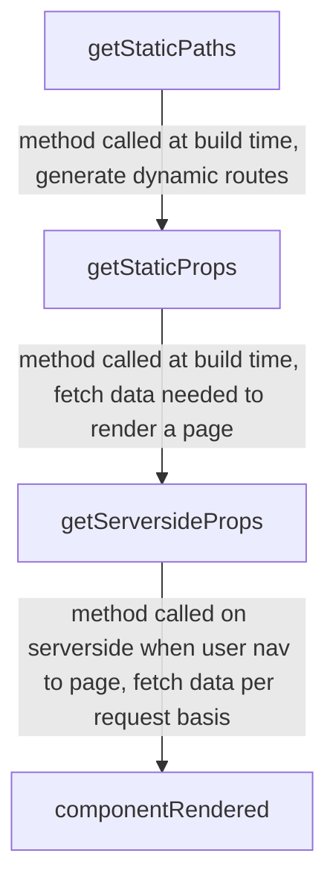

# What is Next.js

Next.js is a complete full-stack framework for modern apps that was created by the brilliant team at [Vercel](https://vercel.com/). *React is used as the view library of choice.* 

- Documentation is based on this [Scott Moss website](https://hendrixer.github.io/nextjs-course/intro)
- [NextJS official documentation](https://nextjs.org/docs)

## Highlights of Next.JS

- Dev build system
- Production build system
- Pre-rendering
	- Server side rendering
	- Build time
	- Static
- Routing
- API routes

## When to use next.JS

#### Do you only need a single page app?

Use Create React App

#### Do you need a static site, like a blog, that's also a SPA?

Use Next.js or Gatsby.

#### Need SSR, an API, and all the above?

Use Next.js

# Getting Started

## First way

You can use `creat-next-app` to get started very quickly.

**npm**

```shell
npx create-next-app
```

**yarn**

```shell
yarn create next-app
```

This will install a boilerplate app and all of its dependencies. The project's `package.json` will have all the needed scripts ready for you as well.

## Second way

**npm**

```shell
npm i next react react-dom --save
```

**yarn**

```shell
yarn add next react react-dom
```

Next, we need to add some helpful scripts to our `package.json`

```json
"scripts": {
  "dev": "next",
  "build": "next build",
  "start": "next start"
}
```

So what do these commands do?

`next` Will start Next.js in dev mode with hot reloading.

`next build` Will build your project and ready it for production.

`next start` Will start your built app, used in production.

> 🧠  **remember**: Next.js is a full-stack framework, by default, it needs to be hosted on a platform that supports Node.js


# Routing with Pages

In Next.js, routing is handled by the file system and the pages directory. Each file in the pages directory represents a route in your application. The file name corresponds to the path of the route and the file exports a React component that will be rendered for that route.

Now let's create an index route by creating a file: `/pages/index.jsx`.

Next, let's create a component and export it:

```jsx
// inside pages/index.jsx
import React from 'react'

export default () => <h1>Index Page</h1>
```

Start your dev server:

**npm**

```shell
npm run dev
```

**yarn**

```shell
yarn dev
```

## Folders and routes

To create a path like `/notes/1`  where `1` is a parameter? We can use folders in our `/pages` directory. For our note taking app, we need the following routes for now:

```text
index => /
all notes => /notes
one note => /notes/:id
```

We already created the index route; let's create the all notes route:

```text
pages
  notes
    index.jsx
```

By adding an `index` page in a folder, we're telling Next.js that we want this component to be the index route for this path. So in this case, navigating to `/notes` will render the `pages/notes/index.jsx` component.

```jsx
// inside pages/notes/index.jsx
import React from 'react'

export default () => <h1>Notes</h1>
```

## Dynamic Routes

Next.js makes it easy to create dynamic routes. Depending on if and how you want those pages to be prerendered will determine how you set them up. We're going to focus on creating dynamic routes that will not be built at build time but instead at run time on the server.

So to create a dynamic route, we can create a file that looks like this:

```text
[id].jsx
```

Where `id` is the name of the parameter. You can name it whatever you want. Those brackets are not a typo or a placeholder; that's the syntax to create a dynamic route using file name conventions in the pages directory. So let's create our note route:

```text
pages
  notes
    index.jsx
    [id].jsx
```

We can access the `id` param inside our page component using the `useRouter` hook from the `next/route` module. This comes for free with Next.js.

```jsx
// inside pages/notes/[id].jsx
import React from 'react'
import { useRouter } from 'next/router'

export default () => {
  const router = useRouter()
  const { id }= router.query

  return (
    <h1>Note: {id} </h1>
  )
}
```

## Catch-all-routes
What's a catch-all route, you say? Think of a glob.

```text
this/folder/**
```

We can do the same with our dynamic routes! All we need is to create a file in our pages directory like this:

```text
docs/[...param].jsx
```

>So the ellipsis `...` is used in this example to same that this file will represent and route that matches `/docs/a` or `docs/a/b` or `docs/a/b/c/d/a/b`. You get the point. You can then access all the params the same way you do with a single route param. The only difference is the value will be an array of the params in order.

```jsx
// inside pages/notes/[...params].jsx
import React from 'react'
import { useRouter } from 'next/router'

export default () =%3E {
    const router = useRouter()
    const { params } = router.query
    console.log(params)
    return (
        %3Ch1>Catch all: {params} </h1>
    )
}
```

If you want to include the parent path in your catch-all route, you can use an **optional catch-all route**.

```text
docs/[[...param]].jsx
```

>So when would you use catch-all routes? I find them useful for when you have a bunch of pages that have pretty similar if not identical layouts and style but have different content and need their own URL. Such things like docs and wikis are a perfect use case.

## Non-pages

So pages are special, but what about when you just need a component? Next.js doesn't have any conventions or opinions about that. The community usually creates a `/src/components` folder where all the components live.

# Navigation

Next.js has a few tricks up its sleeve to help us navigate between pages.

## Link component

Similar to an `<a>` tag, we can use the `Link` component from then `next/link` module.

```jsx
<Link href="/settings">
  <a>settings</a>
</Link>
```

There Link component allows you to do **client-side** routing. This is important because if you don't want that or are linking to another site, then you should just use an `a` tag instead.

The `href` prop takes a page name as it is in the pages directory. For dynamic routes, you will need the `as` prop as well.

```jsx
<Link href="/user/[id].js" as={`/user/${user.id}`}>
  <a>user</a>
</Link>
```

Let's link our pages together!

## Navigating to Static Route

This will navigate us to a static route

```jsx
// pages/index.jsx
import React from 'react'
import Link from 'next/link'

export default () => (
  <div>
    <h1>Index page</h1>

    <Link href="/notes">
      Notes
    </Link>
  </div> 
)
```

## Navigating to Dynamic route

The key prop is used in React when rendering a list of items to uniquely identify each item. It is used to improve the performance of the component and to avoid unexpected behavior.

When React is rendering a list of items, it needs a way to keep track of which items have been added, updated, or removed. Without the key prop, React would have to compare all items in the list to see if any have changed, which could be slow and resource-intensive.

- The key prop is used to assign a unique identifier to each item in the list.

```jsx
// pages/notes/index.js
import React from 'react'
import Link from 'next/link'

export default () => {
  const notes = Array.from({length: 15}, (_, i) => ({ id: i, title: `Note: ${i}` }))

  return (
    <div>
      <h1>Notes</h1>

      <ul>
        {notes.map(note => (
          <li key={note.id}>
            <Link href="/notes/[id]" as={`/notes/${note.id}`}>
                <strong>{note.title}</strong>
            </Link>
          </li>
        ))}
      </ul>
    </div>
  )
}
```

```jsx
// pages/notes/[id].jsx
import React from 'react'
import { useRouter } from 'next/router'
import Link from 'next/link'

export default () => {
  const router = useRouter()
  const { id }= router.query

  return (
    <div>
      <h1>Note: {id} </h1>

      <Link href="/notes">
        Notes
      </Link>
    </div>
  )
}
```

## Programmatic routing

For when you need to route between pages programmatically, you can use the router to do so. There are [many methods](https://nextjs.org/docs/routing/introduction) on the router that you can use, so we'll focus on the ones we'll use in this course.

Just like the `Link` component, use the router for client-side routing. To navigate to a page, you can use the `push` method, which works like `href` on the `Link` component.

```jsx
import React from 'react'
import { useRouter } from 'next/router'

export default () => {
  const router = useRouter()
  const id = 2

  return (
    <div>
      <button onClick={e => router.push('/')}>
        Go Home
      </button>

      <button onClick={e => router.push('/user/[id]', `/user/${id}`)}>
        Dashboard
      </button>
    </div>
  )
}
```

# Root Component of Application

In Next.js, the `_app.jsx` file is a special file that represents the root component of your application. This file is located in the `pages` directory and it allows you to customize the behavior of your application by wrapping the root component with additional functionality.

The `_app.jsx` file is executed on both the client and the server and it serves as the entry point for your application. It wraps the root component of your application, providing it with additional functionality such as:

1.  Global state management: You can use `_app.jsx` to manage global state, such as authentication and user information, that can be shared across all pages of your application.
    
2.  Styling: You can use `_app.jsx` to include global styles for your application, such as CSS or SCSS, that will be applied to all pages.
    
3.  Head management: You can use `_app.jsx` to manage the `<head>` of your application, such as adding meta tags or linking to external resources.
    
4.  Persistence: You can use `_app.jsx` to persist data across page navigations, such as user preferences or scroll position.
    
5.  Error handling: You can use `_app.jsx` to handle errors that occur during the lifecycle of the application, such as catching and displaying errors.
    
6.  Analytics: You can use `_app.jsx` to include analytics libraries, such as Google Analytics, that will be available on all pages.

# Styling

When it comes to styling, you have global styles and component styles. 

## Global CSS

For global CSS, you have to import them at the entry point of your app. Wait, where is the entrance to my Next.js app? It's actually created for you, but you can and have to create your own now that you want global styles.

Create an `pages/_app.jsx` file and add this:

```jsx
import React from "react"
import '../src/component/styles.css'

export default function App({ Component, pageProps }) {
  return <Component {...pageProps} />
}
```

style can then be used across the application. *Best practice to avoid global css import*

## CSS Modules

Now, when you don't want global CSS, Next.js supports [css modules](https://github.com/css-modules/css-modules). This will scope your CSS, avoiding collisions.

> **deep dive**: a unique class name is created every import to reuse the same CSS class names

**You can import a CSS module file anywhere in your app.** To create a CSS module, you have to use a special syntax in the file name.

`styles.module.css`

This makes CSS modules a perfect solution to styling components.

```text
components
  button.jsx
  button.module.css
```

# Theme UI

The following section is not entirely specific to Next.js and takes on how I prefer to style my React apps.

[theme ui](https://theme-ui.com/) is a library that allows you to create theme objects and use them in your components. It also handles scoping and injecting the CSS into your app—pretty dope stuff.

>📏   **TLDR;** create an object representing a theme and use that theme for all your components

Let's get our app looking like an app. First, install some things.

**npm**

```shell
npm i theme-ui @theme-ui/presets --save
```

**yarn**

```shell
yarn add theme-ui @theme-ui/presets
```

Next, we'll create a theme. Make a file on the root of your app.

```text
theme.js
```

```js
import { roboto } from '@theme-ui/presets'

const theme = {
  ...roboto,
  containers: {
    card: {
      boxShadow: '0 1px 3px rgba(0,0,0,0.12), 0 1px 2px rgba(0,0,0,0.24)',
      border: '1px solid',
      borderColor: 'muted',
      borderRadius: '4px',
      p: 2,
    },
    page: {
      width: '100%',
      maxWidth: '960px',
      m: 0,
      mx: 'auto',
    }
  },
  styles: {
    ...roboto.styles
  }
}

export default theme
```

This object uses a preset theme with some extras I added. Throw in a `console.log(theme)` to see what's in there.

Next we'll create a Navigation component at `src/components/nav.jsx`

```jsx
/** @jsx jsx */
import { jsx } from 'theme-ui'
import Link from 'next/link'

const Nav = () => (
  <header sx={{height: '60px', width: '100vw', bg: 'primary', borderBottom: '1px solid', borderColor: 'primary'}}>
    <nav sx={{display: 'flex', alignItems: 'center',  justifyContent: 'space-between', variant: 'containers.page', height: '100%'}}>
      <Link href="/">
        <a sx={{fontWeight: 'bold', fontSize: 4, cursor: 'pointer'}}>Note App</a>
      </Link>

      <Link href="/notes">
        <a sx={{color: 'text', fontSize: 3, cursor: 'pointer'}}>notes</a>
      </Link>

    </nav>
  </header>
)

export default Nav
```

A few subtle but **powerful** things here. First, lets talk about this:

```jsx
/** @jsx jsx */
import { jsx } from 'theme-ui'
```

The "pragma" is a special comment that is used to tell the transpiler to use a specific function (in this case `jsx`) when parsing JSX syntax.

# Customizing Next.js config

If you want to change the build system's behavior, extend Next.js's features, or add ENV variables, you can do this easily in the `next-config.js` file.

You can make various changes to your `next.config.js` file depending on your needs, such as:

-   Changing the webpack configuration
-   Enabling or disabling specific features such as dynamic imports, asset optimization, and CSS extraction
-   Setting environment variables
-   Configuring custom routes
-   Adding custom server middleware
-   Configuring custom webpack loaders and plugins
-   Creating dynamic pages
-   Overriding the default development or production settings
-   And more. It really depends on what you want to achieve and which features you want to customize. The `next.config.js` file allows you to have a lot of control over your Next.js application.

```js
const { PHASE_PRODUCTION_SERVER, PHASE_DEVELOPMENT_SERVER } = require('next/constants')

module.exports = (phase, { defaultConfig }) => {
  // check if the current phase is in production mode
  if (phase === PHASE_PRODUCTION_SERVER) {
    // log that the app is in production mode
    console.log("I'm in prod mode")

    // return the default config
    return defaultConfig
  }

  // log that the app is in development mode
  console.log("I'm in dev mode")

  // return the default config
  return defaultConfig
} 
```

# Plugins

The `next.config.js` file gives us the ability to do some powerful stuff. Because the config file has a convention, you should be able to use changes written by others. These are Next.js plugins.

They look like this:

```js
// next.config.js
const withOffline = require('next-offline')
const config = {
  // your next config
}

module.exports = withOffline(config)
```

ost plugins follow the `withPluginName` format. They also usually take your custom Next.js config, if any, to ensure its returned and consumed by Next.js. This allows you to compose plugins:

Lets make a secrete handler plugin

```

```shell
npm i next-env dotenv-load --dev
```

```js
// next.config.js
const nextEnv = require('next-env')
const dotenvLoad = require('dotenv-load')

dotenvLoad()

const withNextEnv = nextEnv()
module.exports = withNextEnv()
```

Next, create a `.env` file on the root and add some envs.

```text
HELP_APP_URL=https://google.com
```

Can implement the plugin here

```jsx
// src/components/nav.jsx
<a sx={{
    color: 'text',
    fontSize: 3,
    cursor: 'pointer'
  }}
  href={process.env.HELP_APP_URL}
>
  Help
</a>
```

# Adding TypeScript
- just make a tsconfig.json file 
- restart application `npm run dev`
	- will let you know what you have to install

# API Routes

Next.js is a full-stack framework. Fullstack, as in it, has a server, not just for development, for rendering components on your server, but also for an API!

Yes, you can legit ship an API right next to your App with no setup. Let's see how.

All we have to do is create an `api` folder in our `pages` director. The file names and paths work just like pages do. However, instead of building components in those files, we'll create API handlers.

```text
pages
  api
    hello.js
```

>👍🏾   **tip**: Next.js API routes are not the same as Vercel's Serverless API functions, although the setup is similar.

## API Handlers

Now let's create some API handlers to handle data for our Notes app. The handlers are based on [Connect](https://www.npmjs.com/package/connect), which [Express](https://expressjs.com/).

`npm install next-connect`

```js
// pages/api/data
import nc from 'next-connect';
import cors from 'cors'

const handler = nc()
  // use connect based middleware
  .use(cors())
  // express like routing for methods
  .get((req, res) => {
    res.send('Hello world')
  })
  .post((req, res) => {
    res.json({ hello: 'world' })
  })
  .put(async (req, res) => {
    res.end('hello')
  })
  
export default handler;
```

Can test api on terminal with:
```shell
http PUT http://localhost:3000/api # brew install httpie
# short cut
http PUT :3000/api

wget --method=PUT http://localhost:3000/api

curl -X PUT -H "Content-Type: application/json" -d '{}' http://localhost:3000/api
```

>yarn work space still lets us have microservices in monorepos

We need some basic CRUD:

```text
create note => POST /api/note
update note => PATCH /api/note/:id
delete note => DELETE /api/note/:id
get one note => DELETE /api/note/:id
get all notes => DELETE /api/note/
```

So from above, we only have 2 routes: `/api/note/:id`
`/api/note/`

# Fetching Data

There are many ways to fetch data with Next.js. Depending on when you need the data and what you're doing with it, you have options.

> 👍🏾  **tip**: Next.js injects `fetch` into your environment.

> 👍🏾  **tip**: Checkout [swr](https://swr.vercel.app/) and [react-query](https://react-query.tanstack.com/) for your client side data fetching needs.

These are used for pre-rendering data only

What is the difference between build time and server?

>Build time is a one-time process that happens before the application is deployed, while server-side rendering happens every time the client makes a request to the server. 
>
>Build time is used to generate static files that can be cached and served to the client without the need for further server-side processing, while server-side rendering is used to generate dynamic content.

## Static data

All of these methods are for prerendering Pages only (**Build time and Server side rendering**). You cannot use them in components or client-side data fetching. 

- `getStaticProps` - called during the build process before the server starts
	- Used to fetch data that is needed to render a specific page at build time
- `getStaticPaths` - Called at build time and returns an object with the path
	- Used to generate the paths for all dynamic pages that will be pre-rendered at build time. 
- `getServerSideProps` - Called on the server during the rendering phase. 
	- Allows for fetching data and passing it as props to components before the initial render. 



Let's talk about `getStaticProps` on a page.

```jsx
// /pages/index.js

const IndexPage = () => {// jsx }
export default IndexPage

export async function getStaticProps(context) {
  console.log(context)
  
  return {
    props: {}
  }
}
```

This function and all other data fetching functions will only ever run on the server. The actual code won't even be bundled with the client code. That means you can do some exciting things here:

-   file system work
-   connect to a DB
-   crawl a website? Yup.

The `context` object is useful when the page is dynamic. The context will contain the value of the params. This function is not run at runtime in the browser, so where do the params come in?

That's where `getStaticPaths` come in:

## When to use what?

**Do you need data at runtime but don't need SSR?** Use client-side data fetching.

**Do you need data at runtime but do need SSR?** Use `getServerSideProps`

**Do you have pages that rely on data that is cachable and accessible at build time? Like from a CMS?** Use `getStaticProps`

**Do you have the same as above but the pages have dynamic URL params?** Use `getStaticProps` and `getStaticPaths`

# Rendering Modes

`Static Generation` Pages built at build time into HTML. CDN cacheable.

`Server-side Rendering` Pages built at run time into HTML. Cached after the initial hit.

`Client-side Rendering` Single-page app

By default, all pages are prerendered, even if they don't export a data fetching method. You choose the prerendering method (static or SSR) by what data function you export in your page component.

## Working with SSR

```jsx
import dynamic from 'next/dynamic'

const SponsoredAd = dynamic(
  () => import('../components/sponsoredAd'),
  { ssr: false }
)

const Page = () => (
  <div>
    <h1>This will be prerendered</h1>

    {/* this won't*/}
    <SponsoredAd />
  </div>
)

export default Page
```

# Deployment

We're going to deploy to Vercel. It's actually pretty easy. Install the CLI **npm** `npm i -g vercel`

**yarn** `yarn global add vercel`

In your project, run:

```shell
vercel
```

That's it! If your project is already on Github, you can deploy that way from vercel as well. Create an account and connect your Github account.


